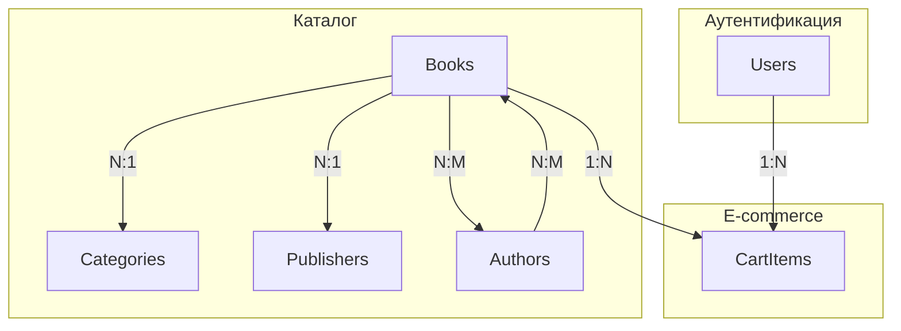

# 📚 Сводное руководство по созданию API книжного магазина

## 📋 Обзор проекта

Данное руководство содержит пошаговые инструкции по созданию полнофункционального REST API для книжного интернет-магазина. Система включает 6 основных модулей, каждый из которых подробно разобран в отдельных файлах.

## 🏗️ Архитектура проекта

```
📁 Структура API
├── 🔐 Аутентификация (JWT + bcryptjs)
├── 📚 Книги (каталог с фильтрацией)
├── 🏷️ Категории (иерархическая структура)
├── 👥 Авторы (управление писателями)
├── 🏢 Издательства (международные издатели)
└── 🛒 Корзина (e-commerce функционал)
```

## 🔗 Связи между модулями



## 📖 Содержание руководств

### [1. 🔐 Аутентификация](./01_AUTHENTICATION_API_GUIDE.md)

**Основа безопасности системы**

- JWT токены для stateless аутентификации
- Хеширование паролей с bcryptjs
- Middleware для проверки прав доступа
- Управление профилем пользователя

**Ключевые эндпоинты:**

- `POST /api/auth/register` - Регистрация
- `POST /api/auth/login` - Вход в систему
- `GET /api/auth/profile` - Получение профиля
- `PUT /api/auth/profile` - Обновление профиля

### [2. 📚 Книги](./02_BOOKS_API_GUIDE.md)

**Центральный модуль каталога**

- Сложная система фильтрации и поиска
- Many-to-Many отношения с авторами
- Пагинация и сортировка результатов
- Административное управление каталогом

**Ключевые эндпоинты:**

- `GET /api/books` - Список с фильтрацией
- `GET /api/books/:id` - Детали книги
- `POST /api/books` - Создание (Admin)
- `PUT /api/books/:id` - Обновление (Admin)
- `DELETE /api/books/:id` - Удаление (Admin)

### [3. 🏷️ Категории](./03_CATEGORIES_API_GUIDE.md)

**Организация каталога**

- Иерархическая структура (родитель-дочерние)
- SEO-friendly URL с slug'ами
- Дерево категорий для навигации
- Проверка циклических зависимостей

**Ключевые эндпоинты:**

- `GET /api/categories` - Список категорий
- `GET /api/categories/tree` - Дерево категорий
- `GET /api/categories/slug/:slug` - По slug
- `POST /api/categories` - Создание (Admin)

### [4. 👥 Авторы](./04_AUTHORS_API_GUIDE.md)

**Управление писателями**

- Поддержка разных типов (автор, переводчик, редактор)
- Валидация дат рождения и смерти
- Поиск по имени и биографии
- Статистика по типам авторов

**Ключевые эндпоинты:**

- `GET /api/authors` - Список с фильтрацией
- `GET /api/authors/:id/books` - Книги автора
- `GET /api/authors/stats` - Статистика
- `POST /api/authors` - Создание (Admin)

### [5. 🏢 Издательства](./05_PUBLISHERS_API_GUIDE.md)

**Управление издателями**

- Международная поддержка (страны)
- Контактная информация
- Статистика по странам и десятилетиям
- Фильтрация по годам основания

**Ключевые эндпоинты:**

- `GET /api/publishers` - Список с фильтрацией
- `GET /api/publishers/:id/books` - Книги издательства
- `GET /api/publishers/countries` - Список стран
- `POST /api/publishers` - Создание (Admin)

### [6. 🛒 Корзина](./06_CART_API_GUIDE.md)

**E-commerce функционал**

- Проверка наличия товаров
- Транзакционная безопасность
- Множественное добавление товаров
- Статистика и аналитика корзины

**Ключевые эндпоинты:**

- `GET /api/cart` - Содержимое корзины
- `POST /api/cart/items` - Добавление товара
- `PUT /api/cart/items/:bookId` - Обновление количества
- `DELETE /api/cart` - Очистка корзины

## 🔧 Общие технические принципы

### 1. Архитектурные паттерны

```javascript
// MVC + Middleware архитектура
src/
├── controllers/          # Бизнес-логика
├── routes/              # Определение маршрутов
├── middleware/          # Валидация и проверки
└── utils/              # Вспомогательные функции
```

### 2. Валидация данных

```javascript
// Модульная валидация с express-validator
const { body, query, param } = require("express-validator");

const validateCreate = [
  body("field").trim().notEmpty().withMessage("Поле обязательно"),
  body("email").isEmail().normalizeEmail(),
];
```

### 3. Обработка ошибок

```javascript
// Единообразная обработка ошибок
const errors = validationResult(req);
if (!errors.isEmpty()) {
  return res.status(400).json({
    success: false,
    message: "Ошибки валидации",
    errors: errors.array(),
  });
}
```

### 4. Ответы API

```javascript
// Стандартизированные ответы
res.json({
  success: true,
  message: "Операция выполнена успешно",
  data: {
    /* результат */
  },
  pagination: {
    /* если применимо */
  },
});
```

## 🛡️ Безопасность

### 1. Аутентификация и авторизация

- JWT токены для stateless аутентификации
- Разделение ролей (user/admin)
- Защищенные маршруты с middleware

### 2. Валидация входящих данных

- Комплексная валидация всех полей
- Санитизация пользовательского ввода
- Проверка форматов (email, URL, даты)

### 3. Защита от атак

- Хеширование паролей (bcryptjs)
- Валидация типов данных
- Ограничения на размеры полей

## 📊 Производительность

### 1. Оптимизация запросов

```javascript
// Эффективные JOIN'ы и подзапросы
const books = await Book.findAndCountAll({
  include: [
    {
      model: Author,
      as: "Authors",
      through: { attributes: [] }, // Исключаем промежуточную таблицу
      attributes: ["id", "name"], // Только нужные поля
    },
  ],
  distinct: true, // Избегаем дублирования
});
```

### 2. Пагинация

```javascript
// Обязательная пагинация для больших наборов
const { page = 1, limit = 10 } = req.query;
const offset = (page - 1) * limit;

const { count, rows } = await Model.findAndCountAll({
  limit: parseInt(limit),
  offset: parseInt(offset),
});
```

### 3. Индексация и поиск

```javascript
// Использование iLike для case-insensitive поиска
where: {
  [Op.or]: [
    { title: { [Op.iLike]: `%${search}%` } },
    { description: { [Op.iLike]: `%${search}%` } }
  ]
}
```

## 🔄 Процесс разработки

### 1. Последовательность создания

1. **Аутентификация** - основа безопасности
2. **Справочники** - категории, авторы, издательства
3. **Основной каталог** - книги с связями
4. **E-commerce** - корзина и заказы

### 2. Тестирование каждого модуля

```bash
# Пример тестирования API
curl -X GET "http://localhost:3000/api/books?page=1&limit=5" \
  -H "Authorization: Bearer TOKEN"
```

### 3. Документирование

- Подробные комментарии в коде
- Описание каждого эндпоинта
- Примеры запросов и ответов

## 🎯 Итоговые возможности системы

После завершения всех модулей у вас будет:

✅ **Полнофункциональный REST API** с 6 основными модулями
✅ **Безопасная аутентификация** с JWT токенами
✅ **Гибкая система каталога** с фильтрацией и поиском
✅ **Иерархические категории** с SEO-оптимизацией
✅ **Управление авторами** с поддержкой разных типов
✅ **Международные издательства** с контактной информацией
✅ **E-commerce корзина** с проверкой наличия товаров
✅ **Административная панель** для управления контентом
✅ **Статистика и аналитика** для всех модулей
✅ **Масштабируемая архитектура** для дальнейшего развития

## 🚀 Следующие шаги

После завершения API можно добавить:

- **Система заказов** - оформление покупок
- **Платежные системы** - интеграция с платежными шлюзами
- **Уведомления** - email/SMS оповещения
- **Рекомендации** - система рекомендаций книг
- **Отзывы и рейтинги** - пользовательские оценки
- **Файловая система** - загрузка обложек книг

Данное руководство предоставляет твердую основу для создания современного книжного интернет-магазина с возможностью дальнейшего масштабирования и добавления новых функций.
